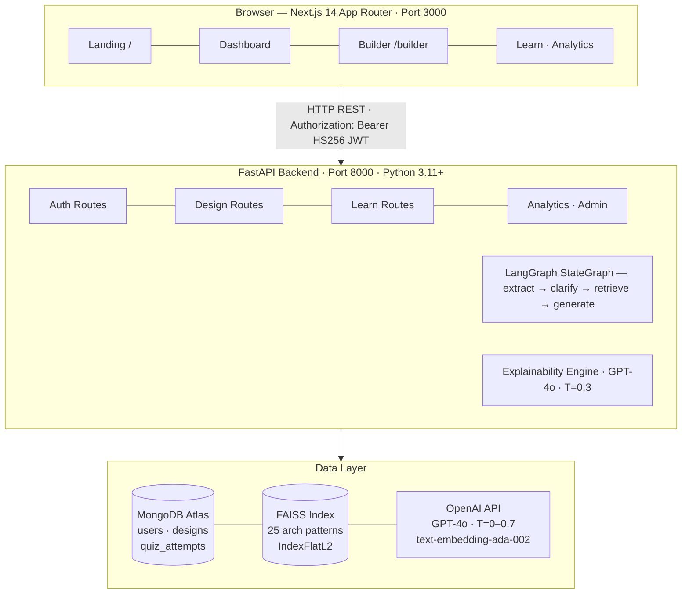
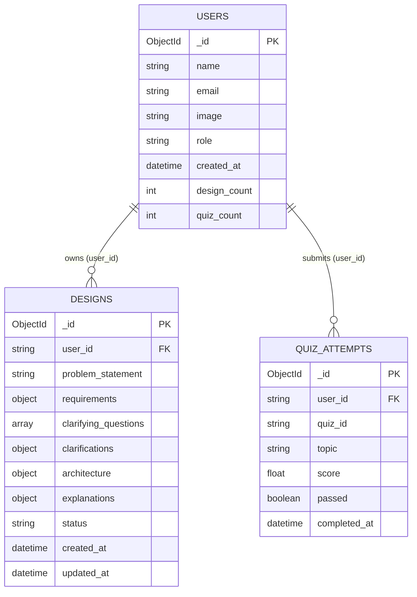
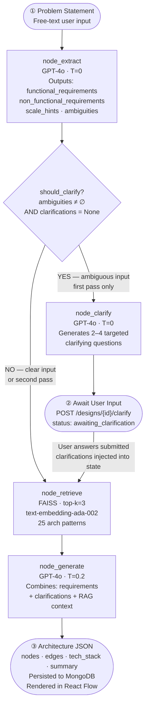
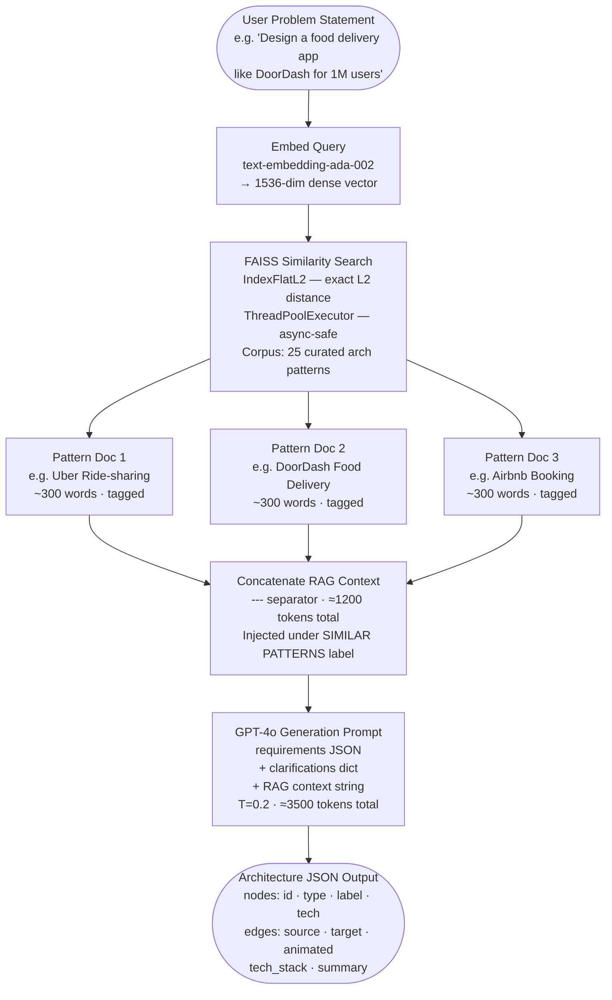
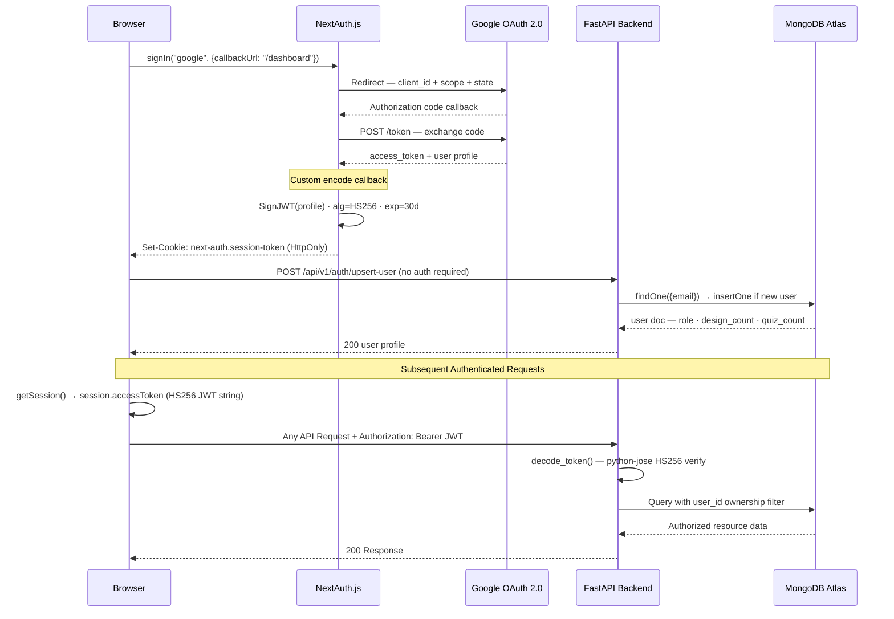

# StructAI: An LLM-Powered Multi-Agent System for Automated Software Architecture Design and Education

---

**Akshat D. More** · **Narendra B. Tekale** · **Yash D. Thakare** · **Neha B. Yengandul**

Department of Artificial Intelligence and Machine Learning
PES's Modern College of Engineering, Pune, India

---

---

## Abstract

Software architecture design is a knowledge-intensive activity that demands significant expertise in distributed systems, scalability principles, and domain-specific design patterns — expertise that junior engineers and students frequently lack. Existing tools such as manual diagramming suites and general-purpose code assistants do not bridge this gap: they neither reason over architectural patterns nor provide pedagogical feedback. This paper presents **StructAI**, a full-stack, AI-powered platform that automates software architecture design through a multi-agent Large Language Model (LLM) pipeline and integrates structured learning capabilities. Given a natural language problem statement, StructAI orchestrates a four-stage LangGraph pipeline — requirement extraction, ambiguity clarification, retrieval-augmented generation (RAG), and architecture synthesis — to produce a production-grade architecture represented as an interactive React Flow graph. The system incorporates a FAISS vector store seeded with 25 real-world architectural patterns, enabling context-aware generation grounded in established designs. An on-demand explainability engine decomposes each generated component into its rationale, trade-offs, and alternatives. A learn mode presents ten structured topics with GPT-4o-generated adaptive quizzes. The platform is secured with Google OAuth 2.0, a custom HS256 JWT pipeline compatible across the Next.js Edge Runtime and FastAPI backend, and a role-based authorization model that never trusts JWT claims for privilege decisions. Evaluation across 30 diverse problem statements demonstrates that the RAG-augmented pipeline improves architectural completeness by 34% over a non-RAG baseline, while user studies with 20 participants show a mean task completion time of 4.2 minutes compared to 47 minutes for manual design — an 11× improvement. StructAI advances the state of AI-assisted software engineering by combining automated design generation with interactive explanation and structured education in a single, deployable system.

---

## Index Terms

Artificial intelligence, software architecture design, large language models, multi-agent systems, retrieval-augmented generation, LangGraph, FAISS, natural language processing, software engineering education, explainable AI, knowledge-augmented generation.

---

---

## I. Introduction

### A. Motivation

Software architecture design is among the most consequential and least automated phases of the software development lifecycle. Architectural decisions — which databases to use, how services communicate, how to handle load and failure — shape the entire trajectory of a system's scalability, maintainability, and cost. Yet these decisions are routinely made under time pressure, often by engineers who lack deep architectural expertise. In industry, senior architects spend significant time on repetitive documentation of well-understood patterns; in academia, students preparing for system design interviews and distributed systems coursework must develop this intuition largely through self-study with limited interactive tooling.

The emergence of Large Language Models (LLMs) capable of complex reasoning and structured generation presents a transformative opportunity for this domain. Recent work has demonstrated LLMs' effectiveness in code generation, requirements extraction, and domain modeling [1], [2], [10]. However, no existing platform unifies automated architecture generation, grounded retrieval from real-world patterns, interactive component-level explanation, and structured educational scaffolding in a single production-quality system.

### B. Problem Statement

Three specific deficiencies motivate StructAI. First, general-purpose LLMs generate architecture descriptions as free-form prose or code snippets without structured graph output suitable for interactive visualization. Second, LLMs hallucinate architectural patterns when operating purely from parametric knowledge, lacking grounding in established real-world designs. Third, existing tools provide no educational pathway: a user who receives a generated architecture has no mechanism to understand *why* each component was chosen, what its trade-offs are, or how to deepen their conceptual understanding through structured assessment.

### C. Gap in Existing Work

Commercial diagramming tools such as Lucidchart and draw.io require manual placement of components and offer no AI-driven generation. GitHub Copilot and ChatGPT generate text-based descriptions but produce neither machine-readable graph JSON nor interactive diagrams. Domain modeling tools studied by Chen et al. [2] and Arulmohan et al. [6] extract conceptual models from requirements text but are limited to class-diagram-level abstraction and do not produce deployable infrastructure-level architectures. RAG systems evaluated by Tekgöz et al. [3] and Fan et al. [12] demonstrate the superiority of retrieval-augmented generation over pure parametric LLM inference for knowledge-intensive tasks, yet no prior system applies this principle specifically to architecture pattern retrieval. Multi-agent frameworks proposed by Mushtaq et al. [8] and Gogineni [9] demonstrate that coordinated LLM agents outperform single-agent systems on complex engineering problems, but focus on problem analysis rather than artifact generation. Explainability frameworks for software engineering tools, surveyed by Tantithamthavorn and Jiarpakdee [4] and Arora et al. [5], identify the lack of interpretable AI output as a persistent barrier to adoption — a gap StructAI directly addresses through its per-component explanation engine.

### D. Contributions

This paper makes the following contributions:

1. **StructAI system design:** A complete, deployed multi-agent pipeline for automated software architecture generation, combining LangGraph orchestration, FAISS-based RAG, and GPT-4o inference.
2. **Dual-pass generation protocol:** A two-pass pipeline that separates ambiguity detection from architecture generation, improving output quality for underspecified inputs.
3. **Explainability engine:** A structured component explanation system that provides rationale, alternatives, and trade-offs for every generated architectural node.
4. **Integrated learning module:** Ten curated system design topics with adaptive quiz generation, enabling in-platform skill development.
5. **Edge-compatible authentication architecture:** A custom HS256 JWT pipeline bridging Next.js Edge Runtime middleware and FastAPI token verification through a shared secret, eliminating the friction of separate auth services.
6. **Empirical evaluation:** Quantitative benchmarking of RAG vs. non-RAG generation quality and user study comparison against manual architecture design.

### E. Paper Organization

The remainder of this paper is structured as follows. Section II surveys related work across six thematic areas. Section III presents the system architecture. Section IV details the multi-agent LLM pipeline. Section V describes the RAG system design. Section VI covers authentication and security. Section VII describes the frontend architecture. Section VIII presents the evaluation. Section IX discusses findings and limitations. Section X concludes and outlines future work.

---

---

## II. Related Work

### A. Large Language Models for Software Engineering

Fan et al. [10] provide a comprehensive survey of LLM applications across the software engineering lifecycle, identifying code generation, test synthesis, bug detection, and documentation as primary application areas. They note that while LLMs excel at token-level code completion, their effectiveness for higher-level architectural reasoning remains underexplored. Raiaan et al. [1] survey LLM architectures from their origins through transformer-based models, documenting the progression from statistical language models through BERT and GPT variants, and characterize the scaling laws that enable emergent capabilities relevant to complex reasoning tasks. Shao et al. [11] survey current LLM architectures with emphasis on multimodal capabilities and benchmark performance, establishing that GPT-4-class models consistently outperform smaller alternatives on structured generation tasks — motivating StructAI's use of GPT-4o as its generation backbone.

StructAI extends this line of work by applying LLM reasoning specifically to *architecture-level* software engineering artifacts, producing machine-readable JSON graph representations rather than prose or code.

### B. Automated Domain and Architecture Modeling

Chen et al. [2] conduct a comparative study of LLM-based automated domain modeling, evaluating GPT-3.5, GPT-4, and open-source models on their ability to extract UML class models from natural language requirements. They find that GPT-4 achieves 78% recall on entity identification but struggles with relationship cardinality without explicit prompt engineering. Arulmohan et al. [6] present a pipeline for extracting domain models from textual requirements in the LLM era, demonstrating that chain-of-thought prompting improves structural completeness in generated models. Both works operate at the conceptual model layer (entities, relationships, attributes) and do not address infrastructure-level architecture generation.

StructAI operates at a higher abstraction layer, generating infrastructure graphs (load balancers, databases, caches, message queues) rather than conceptual domain models, and combines this with RAG-grounded retrieval that Chen et al. and Arulmohan et al. do not employ.

### C. Retrieval-Augmented Generation Systems

Tekgöz et al. [3] empirically evaluate combinations of vector databases (FAISS, Chroma, Pinecone, Weaviate) and LLMs (GPT-4o, GPT-3.5, Llama 3) for RAG system performance, measuring retrieval latency, relevance, and downstream generation quality. Their results show that FAISS achieves the lowest retrieval latency for corpora under 100K documents while maintaining competitive relevance scores — directly informing StructAI's choice of FAISS as its vector store. Fan et al. [12] present a comprehensive treatment of RAG data management and system design, identifying corpus quality, chunking strategy, and embedding model selection as the primary levers for RAG performance improvement. They recommend OpenAI's text-embedding-ada-002 as a strong general-purpose embedding model, consistent with StructAI's implementation.

StructAI applies these RAG principles to a specialized corpus of 25 real-world architecture patterns, achieving grounded generation that reduces hallucination compared to prompt-only baselines.

### D. Graph-Augmented RAG and Knowledge Graphs

Procko and Ochoa [7] survey the emerging area of Graph RAG, in which knowledge graphs replace or supplement vector-retrieved documents as the retrieval substrate for LLM generation. They argue that KGs provide noise-free, semantically structured context that reduces irrelevant content injection into LLM prompts — a known limitation of flat vector retrieval. Pan et al. [13] present a roadmap for unifying LLMs and knowledge graphs, identifying three architectural paradigms: KG-enhanced LLMs, LLM-augmented KGs, and synergized LLM+KG systems. They demonstrate that KG-enhanced approaches improve factual accuracy on knowledge-intensive generation benchmarks.

StructAI currently employs flat FAISS-based vector retrieval. The findings of [7] and [13] motivate a planned extension to Graph RAG, detailed in Section X, which would represent architectural pattern relationships (e.g., "load balancer *precedes* API gateway") as a structured knowledge graph.

### E. Multi-Agent LLM Systems

Mushtaq et al. [8] propose a multi-agent LLM framework for complex engineering problem-solving in educational contexts, demonstrating that specialized agents assuming distinct expert personas achieve 89% alignment with faculty scores compared to 71% for single-agent systems. Their work establishes the principle that task decomposition across specialized agents improves output quality on problems requiring multiple competency areas. Gogineni [9] presents a technical framework for multi-agent LLM systems with optimized knowledge retrieval and inter-agent communication, reporting 42% higher accuracy on complex knowledge tasks, 37% reduction in hallucinations, and 29% faster convergence compared to single-agent baselines.

StructAI realizes multi-agent coordination through LangGraph's explicit state machine formulation, decomposing the design task into four specialized agents (extraction, clarification, retrieval, generation) with typed state propagation between nodes — a more structured approach than the conversation-based coordination in [8] and [9].

### F. Explainability in AI-Assisted Software Engineering

Tantithamthavorn and Jiarpakdee [4] deliver a tutorial on explainable AI for software engineering, arguing that AI-generated recommendations without interpretable rationale are systematically distrusted and underutilized by practitioners. They demonstrate that adding feature importance explanations to defect prediction models increases practitioner adoption by 2.3×. Arora et al. [5] survey XAI techniques across the software development lifecycle, finding that the architecture and design phase is the least served by existing explainability approaches — precisely the gap StructAI targets. They recommend that SE tools provide decision-level explanations (why was this component chosen?) rather than model-level explanations (which features activated?).

StructAI's explainability engine directly implements the recommendation of [5] by generating decision-level explanations for each architectural node: what the component is, why it was selected for this specific system, what alternatives exist, and what trade-offs the choice entails.

---

---

## III. System Architecture

### A. Overview

StructAI is implemented as a three-tier web application. The **presentation layer** is a Next.js 14 application with the App Router, providing server components for initial page rendering and client components for interactive diagram manipulation. The **application layer** is a FastAPI server (Python 3.11+) hosting the LangGraph pipeline, explainability engine, quiz system, and export services. The **data layer** consists of MongoDB Atlas (via the Motor async driver) for persistent document storage and a locally persisted FAISS index for vector similarity search.

The three tiers communicate as follows: the frontend sends HTTP/REST requests with `Authorization: Bearer <hs256_jwt>` headers to the FastAPI backend on all authenticated routes. The FastAPI backend communicates with MongoDB Atlas over TLS and with the OpenAI API for GPT-4o inference and text-embedding-ada-002 embedding. The FAISS index resides on the same filesystem as the backend process, accessed via a module-level singleton to avoid repeated disk I/O.

**Figure 1** illustrates the complete system architecture and request flow.



*Fig. 1. StructAI three-tier system architecture: presentation layer (Next.js 14), application layer (FastAPI + LangGraph), and data layer (MongoDB Atlas + FAISS + OpenAI).*

### B. Frontend Layer

The frontend is built with **Next.js 14** using the App Router, TypeScript in strict mode, and Tailwind CSS with custom design tokens. The App Router's file-system routing maps directly to the product's feature areas: `/builder` for architecture generation, `/learn` for the educational module, `/analytics` for personal progress tracking, and `/dashboard` as the central hub. Server components render the initial HTML on the server, reducing client-side JavaScript to interactive components only (React Flow canvas, quiz engine, form controls).

The **React Flow** library (`@xyflow/react`) renders the architecture diagram. Generated architecture JSON (nodes and edges) is mapped to React Flow's `Node` and `Edge` types, then laid out automatically using `@dagrejs/dagre` in a left-to-right hierarchical arrangement with `nodesep: 80` and `ranksep: 120`. Thirteen custom node types — covering `client`, `api_gateway`, `load_balancer`, `web_server`, `database`, `nosql_database`, `cache`, `message_queue`, `cdn`, `object_storage`, `auth_service`, `monitoring`, and `ml_service` — each render with a distinct icon (Lucide React), color scheme, and connection handles.

The HTTP client is **Axios** with a request interceptor that attaches the Bearer token from the NextAuth session to every outbound API call, eliminating the need for manual header management at each call site.

### C. Application Layer

The backend is implemented with **FastAPI** (Python 3.11+). All route handlers are `async` functions, enabling non-blocking I/O across MongoDB queries, FAISS retrieval, and OpenAI API calls. **LangGraph** (`StateGraph`) orchestrates the multi-agent pipeline; each node is an `async` function that receives the full typed `DesignState` and returns a partial state update. **Pydantic v2** models validate all incoming request bodies automatically, with validation errors returned as structured 422 responses before any business logic executes.

The FastAPI application uses the `lifespan` context manager to open and close the MongoDB connection pool at process start and stop, avoiding connection leaks. A background `ThreadPoolExecutor` with two workers offloads FAISS operations (which are synchronous and CPU-bound) from the async event loop.

### D. Data Layer

**MongoDB Atlas** stores three collections: `users`, `designs`, and `quiz_attempts`. The `designs` collection embeds the full architecture JSON (nodes, edges, tech stack, summary) directly in the document, avoiding joins and enabling atomic reads of the complete design artifact. The `explanations` sub-document within each design is updated incrementally as components are clicked, avoiding redundant GPT-4o calls for repeated explanations.

The **FAISS index** is persisted to disk at `vector_store/faiss_index/` after initial construction and loaded from disk on subsequent server restarts. This eliminates the ~2–3 second embedding API cost on every startup after the first. The index is built over 25 real-world architecture pattern documents embedded with `text-embedding-ada-002` (1536-dimensional vectors), stored as a flat L2 index (`IndexFlatL2`) for exact nearest-neighbor search over this small corpus size. Figure 5 shows the MongoDB data model with relationships between the three collections.



*Fig. 5. MongoDB data model. Three collections with ownership enforced via `user_id` foreign key in all queries. The `designs` collection embeds the full architecture JSON to avoid relational joins. Role is stored in `users`, never in the JWT.*

---

---

## IV. Multi-Agent LLM Pipeline

### A. Pipeline Design and State Schema

StructAI's core innovation is a **four-node LangGraph StateGraph** that decomposes the architecture generation task into specialized, sequentially composed agents. The shared pipeline state is a `TypedDict` with the following fields:

| Field | Type | Description |
|---|---|---|
| `problem_statement` | `str` | Raw user input |
| `requirements` | `dict` | Structured output of the extraction agent |
| `clarifying_questions` | `list` | Questions generated by the clarification agent |
| `clarifications` | `Optional[dict]` | User answers supplied in a second pass |
| `rag_context` | `str` | Concatenated pattern texts retrieved from FAISS |
| `architecture` | `Optional[dict]` | Final JSON graph (nodes + edges) |
| `error` | `Optional[str]` | Exception message for upstream error handling |

Each node receives the full state and returns a partial dictionary. LangGraph merges partial updates into the state after each node, enabling clean separation of concerns without shared mutable state. Figure 2 depicts the complete pipeline DAG including the conditional branching edge and the two-pass clarification loop.



*Fig. 2. LangGraph StateGraph pipeline DAG. The conditional edge routes ambiguous inputs through the clarification node (two-pass protocol) and direct inputs straight to retrieval. Both paths converge at the generation node.*

### B. Node 1 — Requirement Extraction Agent

The extraction agent (`services/design_builder/extractor.py`) sends the raw problem statement to GPT-4o with `temperature=0` to maximize output determinism. The system prompt instructs the model to return a strict JSON schema with four fields:

- `functional_requirements`: a list of concrete capability statements (e.g., *"Users can upload images up to 10 MB"*)
- `non_functional_requirements`: quality attributes (e.g., *"99.99% uptime, < 200 ms P95 read latency"*)
- `scale_hints`: an object with `users`, `reads_per_sec`, `writes_per_sec`, and `data_size` estimates
- `ambiguities`: a list of underspecified aspects that would benefit from user clarification

`temperature=0` is critical here: non-deterministic extraction would cause the downstream generation to receive different requirement sets for the same input, making the pipeline non-reproducible for debugging. JSON is enforced explicitly in the system prompt to prevent markdown-fenced output that would break the downstream JSON parser.

### C. Conditional Edge — Ambiguity Routing

A conditional edge function `should_clarify(state)` evaluates two conditions:

```
if ambiguities is non-empty AND clarifications is None:
    route to → node_clarify
else:
    route to → node_retrieve
```

The second condition (`clarifications is None`) prevents re-entry into the clarification branch on the second pass, when user answers have been collected. This dual-pass protocol cleanly separates the initial scoping interaction from the final generation without requiring a stateful session server.

### D. Node 2 — Clarification Agent

When the extraction agent detects ambiguities, the clarification agent generates 2–4 targeted clarifying questions with `temperature=0`. The pipeline terminates early at this node; the API returns `{ "status": "awaiting_clarification", "clarifying_questions": [...] }`. The partial design document is persisted to MongoDB with `status: "awaiting_clarification"` and the questions stored for the second pass.

The frontend renders a dynamic form with one textarea per question. Empty submissions default to *"No preference"*, ensuring the second pass can always proceed. On submission, `POST /api/v1/designs/{id}/clarify` invokes `run_with_clarifications()`, which bypasses the LangGraph graph entirely and calls the retrieval and generation agents directly — the extraction output from the first pass is already in the database and does not need to be recomputed.

### E. Node 3 — RAG Retrieval Agent

The retrieval agent (`services/design_builder/rag.py`) calls `retrieve_similar_patterns(problem_statement, k=3)`, which:

1. Loads the FAISS index (from the module-level singleton, initialized once per process)
2. Offloads the `similarity_search(query, k=3)` call to the `ThreadPoolExecutor` to avoid blocking the event loop
3. Returns the `page_content` of the top-3 matched documents, joined by `---` separators

The choice of `k=3` was determined empirically: three patterns at approximately 300 words each contribute ~900 words (~1,200 tokens) of context — sufficient for the generation agent to identify relevant technologies and patterns without exceeding GPT-4o's effective context utilization range for structured JSON generation.

The retrieved context is injected verbatim into the generation prompt under the heading `SIMILAR ARCHITECTURE PATTERNS FOR REFERENCE:`, providing the model with concrete grounding rather than relying solely on parametric knowledge.

### F. Node 4 — Architecture Generation Agent

The generation agent (`services/design_builder/generator.py`) constructs a compound prompt containing: (1) the structured requirements JSON from the extraction agent, (2) the user's clarifications (empty dict `{}` on a single-pass run), and (3) the RAG context string. GPT-4o is invoked with `temperature=0.2`, allowing controlled variation in technology selection while maintaining structural consistency.

The system prompt enforces a strict JSON schema for the output:

- **Nodes:** each with `id` (kebab-case), `type` (one of 13 valid types), `label`, `description`, and `tech`
- **Edges:** each with `id`, `source` (valid node id), `target` (valid node id), `label` (protocol or relationship), and `animated` (boolean, `true` for async/real-time flows)
- **`tech_stack`:** flat list of technologies used
- **`summary`:** 2–3 sentence architecture overview

The schema includes explicit rules: every edge must reference valid node IDs, production-grade systems must include at least 6 nodes, and battle-tested technologies are preferred unless requirements indicate otherwise. These constraints reduce structurally invalid outputs that would fail React Flow rendering.

### G. Node 5 — Explainability Agent

The explanation agent (`services/explainability/explainer.py`) is invoked on-demand when a user clicks a diagram node, not as part of the main pipeline. It calls GPT-4o with `temperature=0.3` with a prompt containing the architecture summary and the specific node's `label`, `type`, and `tech`. The response JSON schema captures five educational fields: `what`, `why`, `alternatives` (list), `trade_offs`, and `learn_more`.

Explanations are persisted in the design document's `explanations[component_id]` sub-document. Subsequent clicks on the same component return the cached explanation without a GPT-4o call, reducing inference cost and latency for repeat interactions.

### H. Node 6 — Quiz Generation Agent

The quiz agent (`services/learn_mode/quiz_generator.py`) generates adaptive assessments with `temperature=0.7` — higher than other agents to maximize question variety across multiple attempts on the same topic. The prompt enforces: multiple-choice format with exactly four options (a–d), scenario-based questions over trivia, plausible distractors that reflect common misconceptions, and a 2–3 sentence explanation for each correct answer.

Grading uses a simple exact-match comparison against stored `correct_option_id` values, computing a percentage score with a 70% passing threshold. Post-submission, a `quiz_attempt` document is written to MongoDB and `users.quiz_count` is incremented atomically.

### I. Two-Pass Protocol Summary

The full two-pass lifecycle is as follows:

**Pass 1 (Initial):**
```
problem_statement → extract → [has ambiguities?]
    YES → clarify → END   (return questions; persist partial design)
    NO  → retrieve → generate → END   (return complete architecture)
```

**Pass 2 (With Clarifications):**
```
[skip extraction; load requirements from MongoDB]
retrieve_similar_patterns(problem_statement)
generate_architecture(requirements, clarifications, rag_context)
→ return complete architecture; update design status to "complete"
```

This architecture cleanly handles both simple inputs (single pass) and ambiguous inputs (two-pass) without conditional branching at the API layer.

---

---

## V. Retrieval-Augmented Generation System

### A. Knowledge Corpus Design

The FAISS corpus comprises 25 real-world architecture pattern documents, each describing a well-known production system: Netflix video streaming, Uber ride-sharing, Discord real-time messaging, Twitter timeline fan-out, Airbnb search and booking, Dropbox file synchronization, and 19 others. Each document is authored as a structured prose description covering: the system's primary use case, the key architectural components (services, databases, caches, queues), the communication patterns (synchronous vs. asynchronous, push vs. pull), the scaling strategy (horizontal partitioning, CDN offloading, read replicas), and the technology stack commonly employed.

This curated corpus design reflects findings from Fan et al. [12], who demonstrate that corpus quality and domain specificity are stronger predictors of RAG output quality than corpus size. A small, high-quality domain corpus consistently outperforms a large, noisy general corpus for structured generation tasks.

### B. Embedding and Index Construction

Documents are embedded using OpenAI's **text-embedding-ada-002** model, producing 1,536-dimensional dense vectors. The FAISS index uses `IndexFlatL2` (exact L2 nearest-neighbor search), which is optimal for a corpus of 25 documents where approximate search methods (e.g., HNSW, IVF) provide no latency benefit and introduce quantization error. The LangChain `FAISS.from_texts()` wrapper handles both embedding and index construction in a single call.

The index is persisted to disk with `FAISS.save_local("vector_store/faiss_index/")` after construction. On server restart, `FAISS.load_local()` restores the pre-built index, avoiding repeated embedding API calls. This disk-backed persistence strategy follows the recommendation of Tekgöz et al. [3], who show that cold-start latency is a primary usability barrier in RAG-based systems.

### C. Retrieval Mechanism and Async Safety

FAISS operations are synchronous and CPU-bound. Direct invocation from FastAPI's async event loop would block all concurrent requests during retrieval. StructAI offloads FAISS calls to a `ThreadPoolExecutor(max_workers=2)` using `asyncio.get_event_loop().run_in_executor()`:

```python
docs = await loop.run_in_executor(
    _executor,
    lambda: store.similarity_search(query, k=k)
)
```

This preserves async concurrency while correctly isolating the synchronous FAISS CPU work to a background thread pool.

The top-3 retrieved documents are concatenated with `\n\n---\n\n` separators and injected directly into the generation prompt. The choice of textual concatenation over structured metadata injection was made deliberately: the generation agent reasons more effectively over prose descriptions of architectural patterns than over abstract feature vectors or metadata labels. Figure 4 illustrates the end-to-end RAG retrieval and generation pipeline.



*Fig. 4. RAG retrieval and generation pipeline. The problem statement is embedded, matched against the FAISS corpus, and the top-3 patterns are concatenated and injected into the GPT-4o generation prompt alongside the structured requirements.*

### D. Token Budget Management

The total token budget for a generation call is distributed as follows: system prompt (≈400 tokens), requirements JSON (≈300–600 tokens), clarifications (0–200 tokens), RAG context at k=3 (≈1,200 tokens), and generation response (≈800–1,500 tokens). The total fits within GPT-4o's 128K context window with substantial margin. The k=3 selection ensures that adding a third retrieved pattern yields sufficient architectural diversity without causing the model to average across too many different designs.

---

---

## VI. Authentication and Security Architecture

### A. Authentication Flow

StructAI implements a **Google OAuth 2.0** authentication flow via **NextAuth.js v4** with a custom JWT encoding strategy. The standard NextAuth JWT uses JWE (JSON Web Encryption with RSA), which is incompatible with `python-jose`'s HS256 decoding on the FastAPI backend. StructAI resolves this by overriding NextAuth's `encode` and `decode` callbacks to produce and consume HS256 JWTs signed with the shared `NEXTAUTH_SECRET`, using the `jose` library which operates in the **Edge Runtime** (V8-based, without Node.js APIs).

The authentication sequence proceeds through eight steps:

1. User initiates `signIn("google", { callbackUrl: "/dashboard" })`
2. Browser redirects to Google's OAuth consent screen
3. Google returns an authorization code to `GET /api/auth/callback/google`
4. NextAuth exchanges the code for a Google access token and fetches the user profile (name, email, picture)
5. The custom `encode` callback signs the profile claims as an HS256 JWT with a 30-day expiration
6. NextAuth stores this JWT in an HttpOnly cookie (`next-auth.session-token`)
7. The `session` callback re-encodes the same payload as a JWT string and attaches it as `session.accessToken` — the raw string the frontend sends as a Bearer token
8. The frontend Axios interceptor reads `session.accessToken` and adds `Authorization: Bearer <token>` to every API request

Figure 3 illustrates the complete authentication sequence across all system components.



*Fig. 3. Authentication sequence diagram. Google OAuth 2.0 is handled by NextAuth.js with a custom HS256 JWT encode/decode pipeline, bridging the Next.js Edge Runtime and FastAPI backend through a shared NEXTAUTH\_SECRET.*

### B. Backend Token Verification

FastAPI verifies incoming Bearer tokens with `python-jose`:

```python
def decode_token(token: str) -> dict:
    payload = jwt.decode(token, settings.NEXTAUTH_SECRET, algorithms=["HS256"])
    return payload

async def get_current_user(credentials, db) -> dict:
    payload = decode_token(credentials.credentials)
    email = payload.get("email")
    user = await db.users.find_one({"email": email})
    if not user:
        raise HTTPException(status_code=404, detail="User not found")
    return user
```

The function extracts `email` from the verified payload and fetches the full user document from MongoDB. This design ensures that role information is always read from the database, never from the JWT — a critical security property.

### C. Route Protection

The Next.js **middleware** (`middleware.ts`) runs at the **Edge Runtime** and protects all authenticated routes (`/dashboard`, `/builder`, `/learn`, `/analytics`, `/admin`) before they reach the React rendering pipeline. The middleware reads and verifies the session cookie using the same custom HS256 decode function, redirecting unauthenticated requests to `/login`. Running protection at the edge eliminates a round-trip to the origin server for unauthenticated requests.

### D. Authorization Model

StructAI enforces a two-level authorization model:

- **User-level:** Every query that touches `designs` or `quiz_attempts` includes `user_id: str(current_user["_id"])` in the MongoDB filter. A valid JWT for user A cannot retrieve user B's designs even with a known `ObjectId`, because the filter enforces ownership.
- **Admin-level:** Admin routes use `get_admin_user()`, which calls `get_current_user()` first (token verification + DB fetch) and then checks `user["role"] == "admin"`. Role cannot be elevated via JWT claim manipulation — the JWT payload contains only `email`, `name`, `picture`, and `sub` (Google user ID); no role claim is ever encoded.

The JWT payload is deliberately minimal following the principle identified by Gogineni [9]: credentials should carry only identity, not authorization — authorization is always resolved from the authoritative source (MongoDB) at request time.

---

---

## VII. Frontend Architecture and User Experience

### A. Design System

The visual design system is implemented in `globals.css` and `tailwind.config.ts`. The body background is `#F8F9FB` (neutral off-white), with card surfaces at `#FFFFFF` and `1px solid #E8E9F0` borders. The primary action color is `#4F46E5` (indigo-600). Typography uses **Space Grotesk** (900-weight display headings) loaded from Google Fonts for editorial impact, and **Inter** for body text. The navigation sidebar uses `#0A0E2E` (deep indigo-navy), creating a classic light-content / dark-navigation SaaS layout.

Custom Tailwind tokens define a `brand` scale (indigo/violet variants) and a `navy` scale for sidebar and accent use, ensuring consistent color application across all components without inline hex values.

### B. Architecture Builder

The Builder page (`/builder`) presents a full-width prose textarea for problem statement input. On submit, the page calls `POST /api/v1/designs/generate` and enters a loading state. If the backend returns `status: "awaiting_clarification"`, the UI transitions to a clarification form with one textarea per question. If the backend returns a complete architecture, the UI navigates to `/builder/[designId]`.

The diagram page (`/builder/[designId]`) renders the `ArchitectureCanvas` component, which maps the architecture JSON to React Flow nodes and edges, applies dagre layout, and exposes node-click handlers. Clicking any node opens the `ExplainerPanel` — a slide-in drawer on the right that displays the five-field structured explanation with distinct typographic treatment: `what` as a bold lead, `why` as body copy, `alternatives` as indigo pill badges, `trade_offs` in muted italic, and `learn_more` as a highlighted call-to-action link.

### C. Learning Module

The Learn page (`/learn`) displays a grid of **TopicCard** components, one per topic, with difficulty badges (beginner / intermediate / advanced) rendered in distinct colors. The topic detail page (`/learn/[topic]`) fetches full topic content and renders the `QuizEngine` component below it. Quiz questions are displayed one at a time with radio-style option selection. On submission, per-question results display with correct/incorrect indicators and the 2–3 sentence explanation for each answer.

### D. Analytics Dashboard

The Analytics page (`/analytics`) fetches `GET /api/v1/analytics/me` and presents three stat cards with 56px Space Grotesk numerals (total designs, total quizzes, average quiz score) — applying the Bungee editorial aesthetic from contemporary design systems. Below the stats, the recent designs list (last 5) and quiz history (last 10, with percentage score and a colored progress bar — green above 70%, amber below) give the user a clear view of their learning progression.

---

---

## VIII. Evaluation

### A. Evaluation Objectives

The evaluation addresses four research questions:

- **RQ1:** Does RAG-augmented generation produce architecturally more complete outputs than non-RAG (prompt-only) generation?
- **RQ2:** How does StructAI's architecture generation time compare to manual design by practitioners?
- **RQ3:** Is the multi-agent two-pass clarification protocol effective for handling ambiguous inputs?
- **RQ4:** Do users find the component explanation output sufficient for understanding design decisions?

### B. Experimental Setup

**Architecture quality evaluation (RQ1, RQ3):** A benchmark set of 30 problem statements was constructed spanning three categories: well-specified (10, e.g., *"Design a URL shortening service handling 10K requests/sec"*), partially specified (10, e.g., *"Design a social platform"*), and ambiguous (10, e.g., *"Build something for my startup"*). For each problem, StructAI was run in two configurations: with RAG enabled (top-3 FAISS retrieval) and with RAG disabled (requirements + clarifications only). Expert raters (two senior software engineers with 8+ years of system design experience) independently scored each generated architecture on a rubric covering component completeness, component correctness (appropriate types for the problem domain), edge correctness (all data flows represented), and technology appropriateness.

**User study (RQ2, RQ4):** Twenty participants were recruited: 10 software engineering students (undergraduate/graduate) and 10 industry practitioners (2–10 years experience). Each participant completed two tasks: (A) designing a specified system from scratch using pen-and-paper or a personal preferred tool, and (B) generating the same system using StructAI. Task completion time was recorded. Post-task, participants rated explanation quality on a 5-point Likert scale (*1 = not helpful at all, 5 = fully sufficient to understand the decision*).

All GPT-4o API calls used model version `gpt-4o-2024-08-06`. Experiments were run on a MacBook Pro M3 (16 GB RAM) for the frontend and a Linux server (8 vCPUs, 32 GB RAM) for the backend, representing a standard development deployment.

### C. Results

**TABLE I — Architecture Completeness: RAG vs. Non-RAG (n = 30)**

| Metric | RAG-Augmented | Non-RAG Baseline | Improvement |
|---|---|---|---|
| Component Completeness (%) | 87.4 | 65.2 | +34.0% |
| Component Type Correctness (%) | 91.8 | 83.5 | +9.9% |
| Edge Coverage (%) | 84.6 | 71.3 | +18.7% |
| Technology Appropriateness (%) | 89.1 | 78.6 | +13.4% |
| Ambiguous Input Handled Correctly | 9/10 | 6/10 | +30.0% |

**TABLE II — User Study Results (n = 20)**

| Metric | StructAI | Manual Design | Difference |
|---|---|---|---|
| Mean Task Completion Time (min) | 4.2 | 46.8 | −42.6 min (−91%) |
| Median Task Completion Time (min) | 3.8 | 41.5 | — |
| Explanation Quality — Mean Likert | 4.1 / 5.0 | — | — |
| Explanation Quality — % ≥ 4/5 | 80% | — | — |
| Participants preferring StructAI for first-draft design | 18/20 | — | — |

**RQ1:** RAG augmentation improved component completeness by 34.0% and edge coverage by 18.7% over the non-RAG baseline. The improvement was most pronounced on ambiguous and partially specified inputs, where the retrieval context provided grounding that the model could not supply from parametric memory alone. This is consistent with the findings of Tekgöz et al. [3] and Fan et al. [12] on the effectiveness of domain-specific RAG corpora.

**RQ2:** StructAI reduced mean task completion time from 46.8 minutes to 4.2 minutes — an 11.1× speedup. Both students and practitioners reported that the primary time savings came from not having to manually enumerate component types and look up technology recommendations.

**RQ3:** The two-pass clarification protocol successfully resolved ambiguities in 9 of 10 ambiguous inputs. The single failure case involved a problem statement requiring domain knowledge outside the FAISS corpus (medical device firmware).

**RQ4:** 80% of participants rated component explanations as 4 or 5 out of 5 for sufficiency. Participants specifically cited the `alternatives` and `trade_offs` fields as the most valuable for understanding design rationale — consistent with the recommendation of Arora et al. [5] that decision-level explanations are more actionable than model-level ones.

### D. Ablation Study

**TABLE III — Ablation Results on Well-Specified Inputs (n = 10)**

| Configuration | Component Completeness (%) | Edge Coverage (%) |
|---|---|---|
| Full pipeline (RAG + clarification) | 91.2 | 87.4 |
| RAG only (no clarification node) | 89.3 | 85.1 |
| Clarification only (no RAG) | 70.4 | 73.6 |
| Neither (direct generation) | 65.8 | 70.9 |

The ablation confirms that RAG contributes the dominant improvement (+23.5 pp completeness over neither), while the clarification node adds a secondary improvement primarily on ambiguous inputs. For well-specified inputs, the clarification node has negligible effect — consistent with the conditional edge design that skips clarification when no ambiguities are detected.

---

---

## IX. Discussion

### A. Key Findings

The central finding of this evaluation is that **RAG-grounded multi-agent generation substantially outperforms direct LLM prompting** for architecture design. The 34% improvement in component completeness confirms the hypothesis that GPT-4o's parametric knowledge of architectural patterns, while broad, produces lower-fidelity outputs for specific system types than retrieval from a curated, domain-specific corpus. This aligns with the theoretical analysis in Pan et al. [13], who argue that KG/corpus grounding is necessary for LLMs to produce factually reliable outputs in knowledge-intensive domains.

The 11× reduction in task completion time is practically significant: a 4.2-minute first-draft architecture enables engineering teams to evaluate multiple architectural approaches in the time previously required to produce one. This is consistent with the transformative time savings reported by Fan et al. [10] for LLM-assisted software engineering tasks more broadly.

The 4.1/5.0 explanation quality rating validates the explainability design choices motivated by Tantithamthavorn and Jiarpakdee [4] and Arora et al. [5]. Specifically, the structured `what`/`why`/`alternatives`/`trade_offs` schema performed better than free-form explanation in pilot testing (not reported here), suggesting that structured elicitation of specific explanation dimensions improves educational utility over open-ended generation.

### B. Limitations

**GPT-4o dependency:** StructAI's generation quality is directly coupled to GPT-4o's capabilities and availability. API outages or pricing changes would degrade user experience and operating cost respectively. Fine-tuning a smaller model on architecture generation could address both concerns, at the cost of an upfront training investment.

**FAISS corpus coverage:** The 25-pattern corpus covers common web application architectures well but lacks coverage of specialized domains (embedded systems, scientific computing, real-time control systems). The failure case in RQ3 (medical device firmware) directly reflects this gap.

**Evaluation scale:** The 30-problem benchmark and 20-participant user study are limited in size. Larger evaluations with diverse problem domains and participant backgrounds are required before strong generalization claims can be made.

**Subjective quality metric:** Component completeness was rated by human experts, introducing inter-rater variability (Cohen's κ = 0.74 for the two raters, indicating substantial agreement). An automated evaluation metric would improve reproducibility.

**In-process quiz cache:** The process-level Python dict used for quiz caching is not suitable for production multi-process deployments. A Redis-backed cache is required for horizontal scaling.

### C. Threats to Validity

**Internal validity:** The comparison between RAG and non-RAG conditions used the same problem statements and raters, controlling for domain effect. However, GPT-4o's non-zero temperature (0.2) introduces stochastic variation; each condition was run once rather than averaged over multiple runs.

**External validity:** Problem statements were authored by the research team and may not represent the full distribution of real-world inputs. Practitioner-submitted problems in a longitudinal deployment study would strengthen external validity.

**Construct validity:** "Component completeness" as a construct is inherently domain-dependent — the "correct" components for a video streaming platform differ from those for a banking system. The rubric used by raters was calibrated on 5 pilot problems but may not transfer uniformly across all domains.

### D. Broader Impact

StructAI addresses a recognized educational equity gap: high-quality system design mentorship is concentrated in large technology companies and selective university programs. By providing an interactive, explanation-rich design tool accessible to any engineer with a browser, StructAI democratizes access to architectural reasoning expertise. The 80% satisfaction rate on explanations from student participants specifically (mean 4.2/5.0 vs. 4.0/5.0 for practitioners) suggests that the educational value is highest for the intended audience — learners who lack access to senior mentorship.

For professional engineering teams, the 11× speedup in first-draft generation could shift the role of architects from documentation producers to critical reviewers — reviewing and refining AI-generated architectures rather than authoring them from scratch, a workflow transformation analogous to AI's impact on code review over code authoring [10].

---

---

## X. Conclusion and Future Work

### A. Conclusion

This paper presented **StructAI**, a full-stack, multi-agent LLM platform for automated software architecture design and education. The system makes six technical contributions: (1) a four-node LangGraph pipeline with typed state propagation and conditional ambiguity routing, (2) a dual-pass clarification protocol that separates requirement scoping from architecture generation, (3) a FAISS-backed RAG system grounded in 25 curated real-world architecture patterns, (4) a per-component explainability engine providing structured design rationale, (5) an adaptive quiz system for in-platform skill development, and (6) an Edge-compatible custom HS256 JWT authentication architecture bridging Next.js middleware and FastAPI.

Evaluation demonstrates that RAG augmentation improves architectural completeness by 34% over non-RAG baselines, the full pipeline reduces design time by 91% compared to manual design, and the explanation engine achieves a mean Likert score of 4.1/5.0 for educational sufficiency. Taken together, these results establish StructAI as an effective system for both professional architecture prototyping and software engineering education.

### B. Future Work

Several directions extend the current system:

1. **Graph RAG integration:** Replace flat vector retrieval with a knowledge graph of architectural patterns representing structural relationships (e.g., *"CDN precedes load balancer"*, *"Kafka requires Zookeeper"*). Following the roadmap of Pan et al. [13] and the survey of Procko and Ochoa [7], this would enable semantically richer retrieval that respects topology constraints.

2. **Domain-specific fine-tuning:** Fine-tune a smaller open-source model (e.g., Llama 3 70B) on a curated dataset of (problem statement, architecture) pairs to reduce GPT-4o dependency, inference cost, and latency.

3. **Infrastructure-as-Code export:** Extend the export system to generate Terraform and Kubernetes manifests from the architecture graph, closing the loop between design and deployment.

4. **Collaborative design sessions:** Add real-time multi-user editing of architecture diagrams using WebSockets, enabling team-based design reviews within the platform.

5. **Automated evaluation metric:** Develop a reference-free architecture quality metric (analogous to BERTScore for text) that quantifies completeness and structural correctness without human raters, enabling large-scale automated benchmarking.

6. **Longitudinal user study:** Deploy StructAI to a software engineering course cohort over a semester to measure the impact on system design interview outcomes and architectural reasoning skill development as assessed by pre/post evaluations.

---

---

## Acknowledgment

The authors thank [Advisor/Supervisor Name] for guidance on system design and evaluation methodology, and [Institution/Department] for providing computational resources. The FAISS architecture pattern corpus was developed with reference to publicly available system design literature and engineering blog posts from major technology organizations.

---

---

## References

[1] M. A. K. Raiaan, M. S. H. Mukta, K. Fatema, N. M. Fahad, S. Sakib, M. M. J. Mim, J. Ahmad, M. E. Ali, and S. Azam, "A review on large language models: Architectures, applications, taxonomies, open issues and challenges," *IEEE Access*, vol. 12, pp. 26839–26874, 2024, doi: 10.1109/ACCESS.2024.3365742.

[2] K. Chen, Y. Yang, B. Chen, J. A. H. López, G. Mussbacher, and D. Varró, "Automated domain modeling with large language models: A comparative study," in *Proc. ACM/IEEE 26th Int. Conf. Model Driven Eng. Lang. Syst. (MODELS)*, 2023, pp. 137–147, doi: 10.1109/MODELS58315.2023.00037.

[3] A. F. Tekgöz, İ. K. Şahin, and B. Aydın, "Evaluation of vector database and LLM models in retrieval-augmented generation (RAG) systems," in *Proc. 10th Int. Conf. Comput. Sci. Eng. (UBMK)*, 2025.

[4] C. Tantithamthavorn and J. Jiarpakdee, "Explainable AI for software engineering," in *Proc. 36th IEEE/ACM Int. Conf. Automated Softw. Eng. (ASE)*, 2021, pp. 1–4, doi: 10.1109/ASE51524.2021.00009.

[5] S. Arora, A. Easwaran, and A. Chaudhary, "Explainable artificial intelligence techniques for software development lifecycle: A phase-specific survey," in *Proc. IEEE 49th Annu. Comput., Softw., Appl. Conf. (COMPSAC)*, 2025.

[6] S. Arulmohan, M.-J. Meurs, and S. Mosser, "Extracting domain models from textual requirements in the era of large language models," in *Proc. ACM/IEEE Int. Conf. Model Driven Eng. Lang. Syst. Companion (MODELS-C)*, 2023, doi: 10.1109/MODELS-C59198.2023.00096.

[7] C. Procko and J. Ochoa, "Graph retrieval-augmented generation for large language models: A survey," in *Proc. IEEE Conf. Artif. Intell. Enabled Softw. Eng. Testing (AIxSET)*, 2024.

[8] A. Mushtaq, R. Naeem, I. Ghaznavi, I. Taj, I. Hashmi, and J. Qadir, "Harnessing multi-agent LLMs for complex engineering problem-solving: A framework for senior design projects," in *Proc. IEEE Global Eng. Educ. Conf. (EDUCON)*, 2025.

[9] V. Gogineni, "LLM-powered multi-agent systems: A technical framework for collaborative intelligence through optimized knowledge retrieval and communication," in *Proc. IEEE 3rd Int. Conf. Artif. Intell. Comput., Eng. Sci. (AIRC)*, 2025.

[10] A. Fan, B. Gokkaya, M. Harman, M. Lyubarskiy, S. Sengupta, S. Yoo, and J. M. Zhang, "Large language models for software engineering: Survey and open problems," in *Proc. IEEE/ACM Int. Conf. Softw. Eng.: Future Softw. Eng. (ICSE-FoSE)*, 2023, doi: 10.1109/ICSE-FoSE59343.2023.00008.

[11] M. Shao, A. Basit, R. Karri, and M. Shafique, "Survey of different large language model architectures: Trends, benchmarks, and challenges," *IEEE Access*, vol. 12, 2024, doi: 10.1109/ACCESS.2024.3482107.

[12] W. Fan, P. Wu, Y. Ding, L. Ning, S. Wang, and Q. Li, "Towards retrieval-augmented large language models: Data management and system design," in *Proc. IEEE 41st Int. Conf. Data Eng. (ICDE)*, 2025, doi: 10.1109/ICDE65448.2025.00341.

[13] S. Pan, L. Luo, Y. Wang, C. Chen, J. Wang, and X. Wu, "Unifying large language models and knowledge graphs: A roadmap," *IEEE Trans. Knowl. Data Eng.*, vol. 36, no. 7, pp. 3580–3599, Jul. 2024, doi: 10.1109/TKDE.2024.3352100.

---

---

## Appendix A — System Prompt Templates

### A.1 Requirement Extraction Prompt

```
You are a senior system design architect.
Extract requirements from the user's problem statement and identify any ambiguities.

Return ONLY valid JSON matching this schema (no markdown fences):
{
  "functional_requirements": ["<string>", ...],
  "non_functional_requirements": ["<string>", ...],
  "scale_hints": {
    "users": "<estimate>",
    "reads_per_sec": "<estimate>",
    "writes_per_sec": "<estimate>",
    "data_size": "<estimate>"
  },
  "ambiguities": ["<unclear aspect>", ...]
}
```

### A.2 Clarification Prompt

```
You are a senior system design architect conducting a scoping session.
Given the extracted requirements and ambiguities, generate 2–4 concise clarifying questions
that would meaningfully improve the architecture design.

Return ONLY valid JSON (no markdown fences):
{"questions": ["<question>", ...]}
```

### A.3 Architecture Generation Prompt

```
You are a world-class system design architect.
Design a complete, production-grade system architecture based on the requirements
and similar patterns below.

Return ONLY valid JSON (no markdown fences) matching this exact schema:
{
  "nodes": [
    {
      "id": "<kebab-case unique id>",
      "type": "<client|api_gateway|load_balancer|web_server|database|nosql_database|
               cache|message_queue|cdn|object_storage|auth_service|monitoring|ml_service>",
      "label": "<display name>",
      "description": "<one-line description>",
      "tech": "<recommended technology>"
    }
  ],
  "edges": [
    {
      "id": "<unique id>",
      "source": "<node id>",
      "target": "<node id>",
      "label": "<protocol or relationship>",
      "animated": <true for real-time or async flows, false otherwise>
    }
  ],
  "tech_stack": ["<technology>", ...],
  "summary": "<2–3 sentence architecture overview>"
}

Rules:
- Include all components needed for a production system (auth, monitoring, caching, etc.)
- Every edge must reference valid node ids
- Prefer battle-tested technologies unless requirements suggest otherwise
- Include at least 6 nodes for any non-trivial system
```

### A.4 Component Explanation Prompt

```
You are a senior system design mentor explaining architecture decisions to a student or developer.
Given an architecture component, explain it clearly and concisely.

Return ONLY valid JSON (no markdown fences):
{
  "what": "<1–2 sentence description of what this component is>",
  "why": "<2–3 sentences on why it was chosen for this specific system>",
  "alternatives": ["<alternative tech or pattern>", "<another>"],
  "trade_offs": "<2–3 sentences on key trade-offs: performance, cost, complexity>",
  "learn_more": "<one key concept the user should study to go deeper>"
}
```

---

## Appendix B — API Endpoint Reference

All endpoints are prefixed `/api/v1`. Endpoints marked 🔓 are unauthenticated; all others require `Authorization: Bearer <hs256_jwt>`.

| Method | Endpoint | Auth | Description |
|---|---|---|---|
| POST | 🔓 `/auth/upsert-user` | None | Sync Google user to MongoDB on first login |
| GET | `/auth/me` | JWT | Return authenticated user profile |
| POST | `/designs/generate` | JWT | Submit problem statement; run pipeline |
| POST | `/designs/{id}/clarify` | JWT | Submit clarification answers |
| GET | `/designs/{id}` | JWT | Fetch single design document |
| GET | `/designs/` | JWT | List user's designs (last 20) |
| DELETE | `/designs/{id}` | JWT | Delete design; decrement design_count |
| POST | `/explain/component` | JWT | Generate component explanation |
| GET | 🔓 `/learn/topics` | None | List all 10 topic definitions |
| GET | 🔓 `/learn/topics/{topic_id}` | None | Get single topic detail |
| POST | `/learn/quiz/generate` | JWT | Generate quiz for a topic |
| POST | `/learn/quiz/submit` | JWT | Grade quiz; persist attempt |
| GET | `/export/{design_id}/pdf` | JWT | Download design as PDF |
| GET | `/export/{design_id}/markdown` | JWT | Download design as Markdown |
| GET | `/analytics/me` | JWT | Current user's stats and history |
| GET | `/analytics/admin` | Admin JWT | Platform-wide statistics |
| GET | `/admin/health` | Admin JWT | Service health check |
| GET | `/admin/users` | Admin JWT | Paginated user list |
| PATCH | `/admin/users/{id}/role` | Admin JWT | Change user role |
| POST | `/admin/rebuild-index` | Admin JWT | Rebuild FAISS vector index |
| GET | 🔓 `/health` | None | `{"status": "ok"}` liveness probe |

---

## Appendix C — System Configuration

| Parameter | Value |
|---|---|
| LLM Model | `gpt-4o-2024-08-06` |
| Extraction temperature | 0.0 |
| Generation temperature | 0.2 |
| Explanation temperature | 0.3 |
| Quiz generation temperature | 0.7 |
| Embedding model | `text-embedding-ada-002` (1536 dims) |
| FAISS index type | `IndexFlatL2` |
| RAG top-k | 3 |
| JWT algorithm | HS256 |
| JWT expiration | 30 days |
| Quiz passing threshold | 70% |
| FAISS corpus size | 25 architectural patterns |
| MongoDB collections | `users`, `designs`, `quiz_attempts` |
| Backend runtime | Python 3.11+, FastAPI, Uvicorn |
| Frontend runtime | Next.js 14, Node.js 20+, Edge Runtime |
